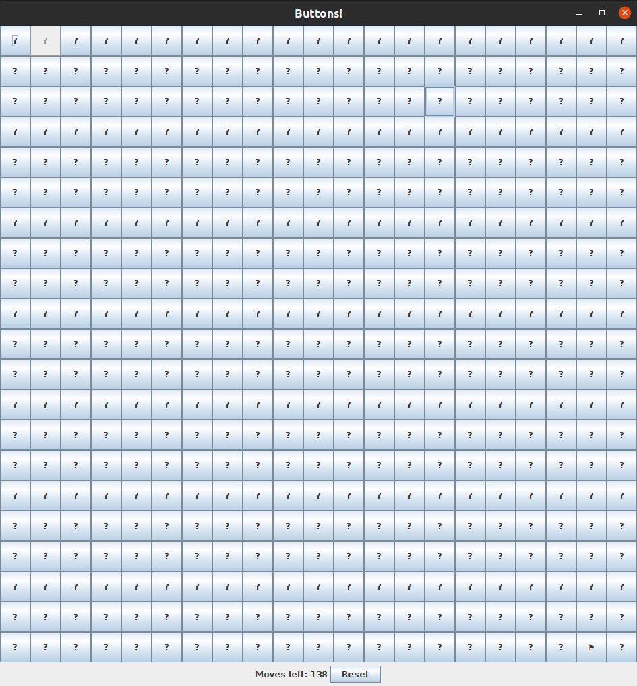
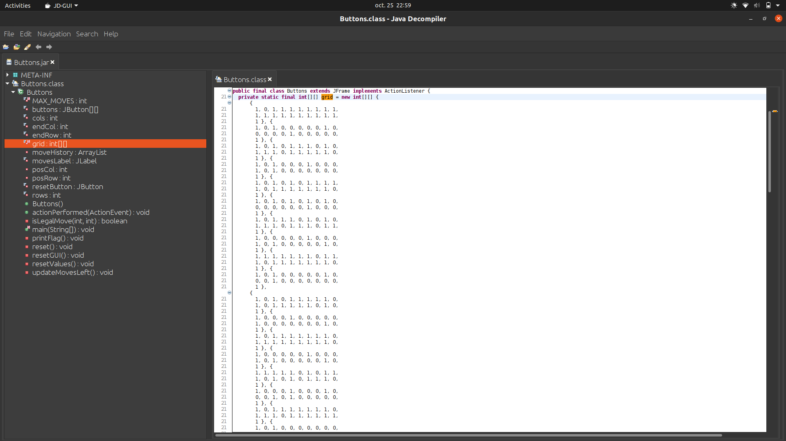
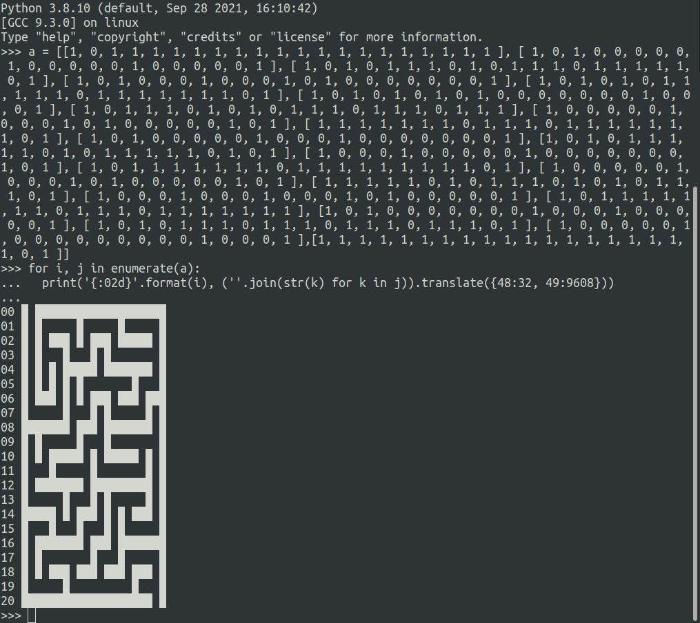
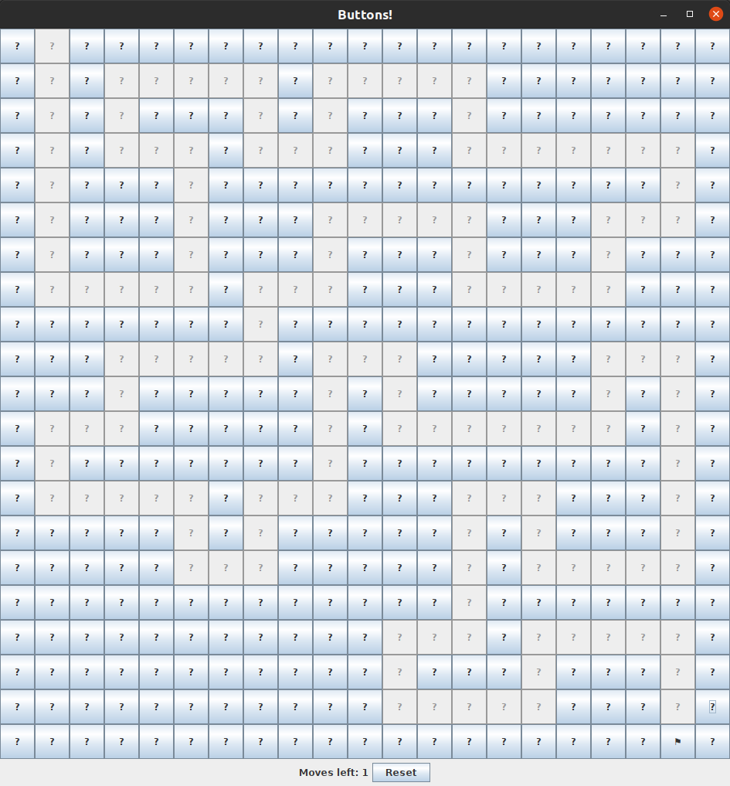

# Buttons

Pour ce chall on nous donne un fichier `.jar`, donc plutôt que de sortir directement les outils on va commencer par le lancer.

On se retrouve avec une grille de cases contenant des points d'interrogation, et un drapeau dans l'une d'entre elle.

On peut essayer de cliquer sur des cases au hasard, mais on obtient le message suivant : `Illegal move, you lose :(`. Joie.

Décompilons le `.jar`. On remarque un tableau de tableau d'entiers composé de `0` et de `1` :

Et si on l'affichait proprement ? Allez, un peu de python :

On se retrouve avec un joli labyrinthe, qu'on n'a plus qu'à résoudre :)

