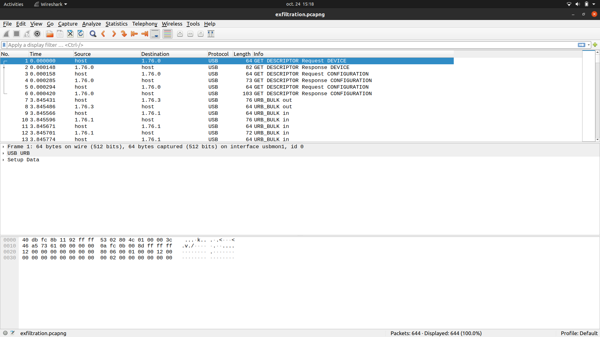

# USB Exfiltration

Pour ce chall on nous donne un fichier `.pcapng`, donc allons voir ce qu'il contient avec wireshark.

On obtient les paquets suivants :



On peut voir qu'une bonne partie des paquets sont de type `URB_BULK out`, et c'est ceux-là qui vont nous intéresser. Regardons donc à l'intérieur :


Les 64 premiers octets correspondent à des infos diverses et variées (par exemple l'adresse du périphérique usb `usb.device_adress`), et le reste est de type Leftover Capture Data `usb.capdata`. On va donc extraire cette information.

Pour cela, on va utiliser `tshark` de la façon suivante :
```bash
tshark -r exfiltration.pcapng -T fields -e usb.capdata > raw_data
```

L'option `-r` permet de lire les paquets depuis notre fichier `exfiltration.pcapng`, et les options `-T fileds -e usb.capdata` permettent d'extraire uniquement les paquets de type `usb.capdata`.

Ce fichier étant au format hexadécimal, on va le convertir au format binaire avec `xxd` :
```bash
xxd -r -p raw_data bin_data.bin
```

Examinons le contenu de ce fichier :
```bash 
strings bin_data.bin
```

On trouve ça à la fin :
```
meme.pngUT
saux
flag.b64UT
saux
```

On va donc extraire les fichiers qui semblent être dans ce fichier binaire :
```bash
binwalk -e bin_data.bin
```

Et on décode le fichier contenant le flag :
```bash
base64 -d flag.b64
```
Et voilà !

